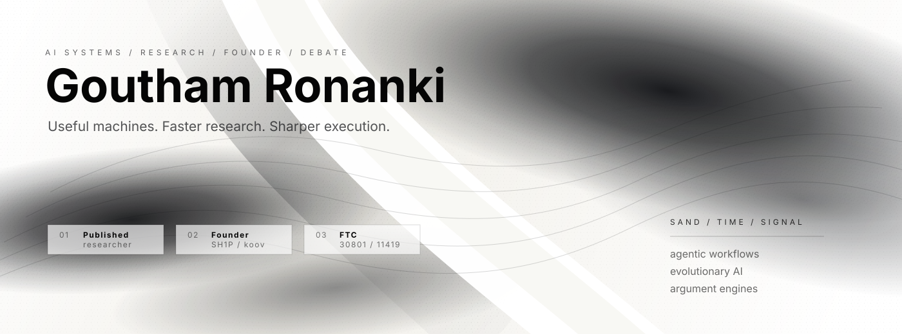

<!-- PROFILE README FOR: github.com/ItCodinTime -->

  

  
  
  
  

  <code>PWSHS '27</code> &nbsp;/&nbsp;
  <code>Published Researcher</code> &nbsp;/&nbsp;
  <code>Founder</code> &nbsp;/&nbsp;
  <code>PF Debater</code> &nbsp;/&nbsp;
  <code>FTC 30801 + 11419</code>

 

<table>
  <tr>
    <td width="58%" valign="top">
      <h3>Signal</h3>
      

        I build systems at the edge of AI, automation, research, and argument. The work is measured by whether it becomes useful under pressure: faster research, cleaner execution loops, stronger evidence, and software that does not collapse when the input gets messy.
      

      <blockquote>
        The target is simple: make the machine useful, fast, and hard to ignore.
      </blockquote>
    </td>
    <td width="42%" valign="top">
      <h3>Operating Lanes</h3>
      <table>
        <tr>
          <td><strong>AI systems</strong></td>
          <td>Agentic workflows, RAG, automation loops</td>
        </tr>
        <tr>
          <td><strong>Research</strong></td>
          <td>NEAT, evolutionary learning, neural networks</td>
        </tr>
        <tr>
          <td><strong>Founder mode</strong></td>
          <td>HCO @ SH1P, founding team @ koov</td>
        </tr>
        <tr>
          <td><strong>Competition</strong></td>
          <td>FTC strategy, debate evidence, prep systems</td>
        </tr>
      </table>
    </td>
  </tr>
</table>

---

## Achievement Field

| Axis | Evidence |
| --- | --- |
| **Published researcher** | Research work around NEAT, evolutionary learning, neural networks, and applied experimentation. |
| **Founder / operator** | HCO @ SH1P, founding team @ koov, pitch infrastructure, execution loops, and startup systems. |
| **AI systems builder** | Agentic workflows, RAG pipelines, automation loops, and deployment-aware prototypes. |
| **Debate-trained problem solver** | PF debate research, evidence retrieval, strategy tooling, and high-pressure reasoning. |
| **FTC contributor** | FTC 30801 / 11419 with strategy, build thinking, and competition execution. |

---

## Build Stack

  
  
  
  
  
  
  
  

  
  
  
  
  
  
  
  

---

## Systems In Motion

| Project lane | Direction |
| --- | --- |
| **NEAT / evolutionary AI** | Open-source experiments around self-learning agents and topology search. |
| **Job-search automation** | Systems that create tailored proof-of-work so applicants stand out. |
| **Startup infrastructure @ SH1P** | Founder ops, faster execution loops, and less performative noise. |
| **Argument engines** | Debate research workflows, evidence retrieval, and strategy tooling. |

---

## GitHub Pulse

  
  

  

  

---

## Writing / Media

- NEAT and evolution-style learning for neural networks.
- Notes on AI agents, argument, and real-world constraints.
- Building in public with a bias toward shipped systems.

  <code>sand / time / signal</code>

